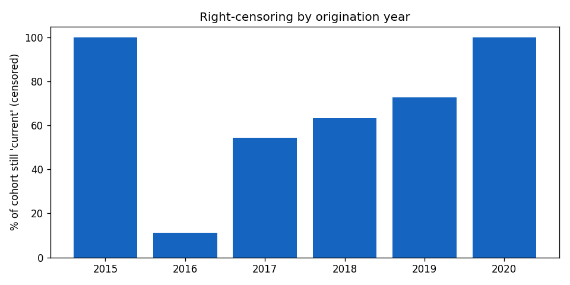
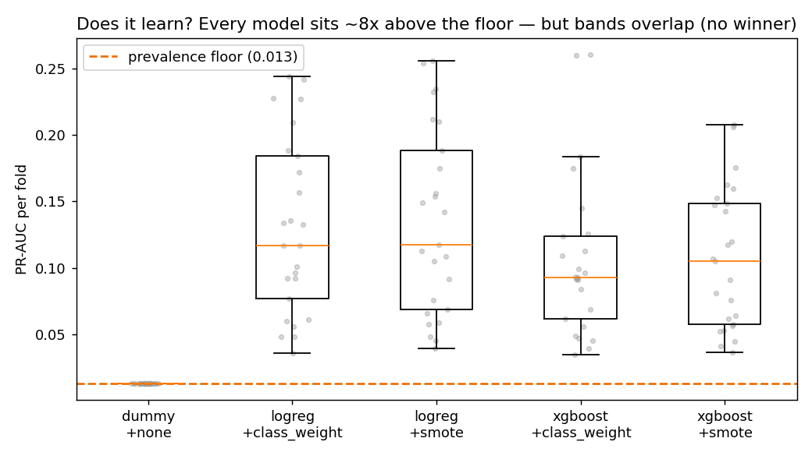
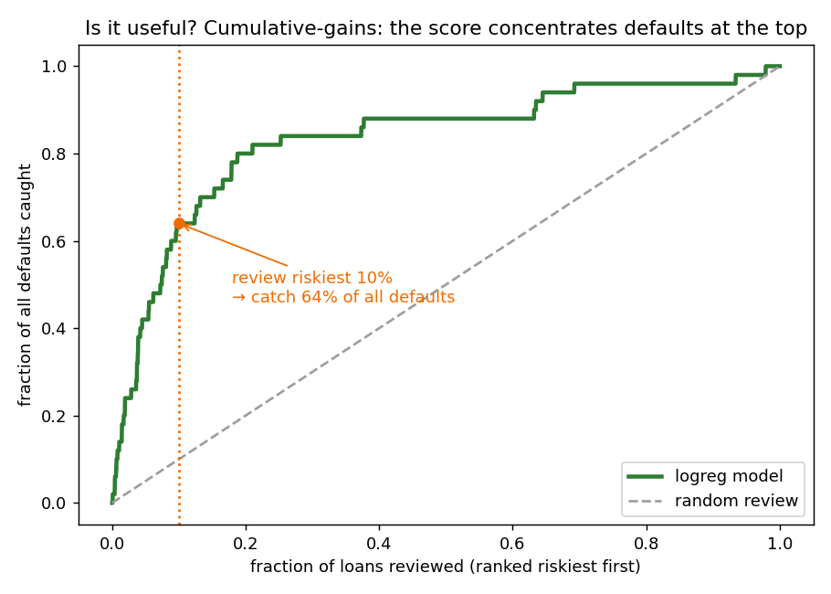
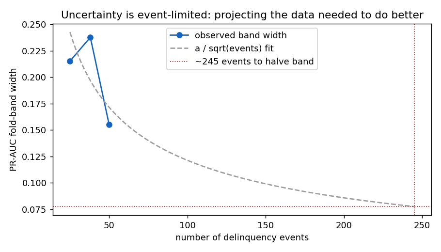
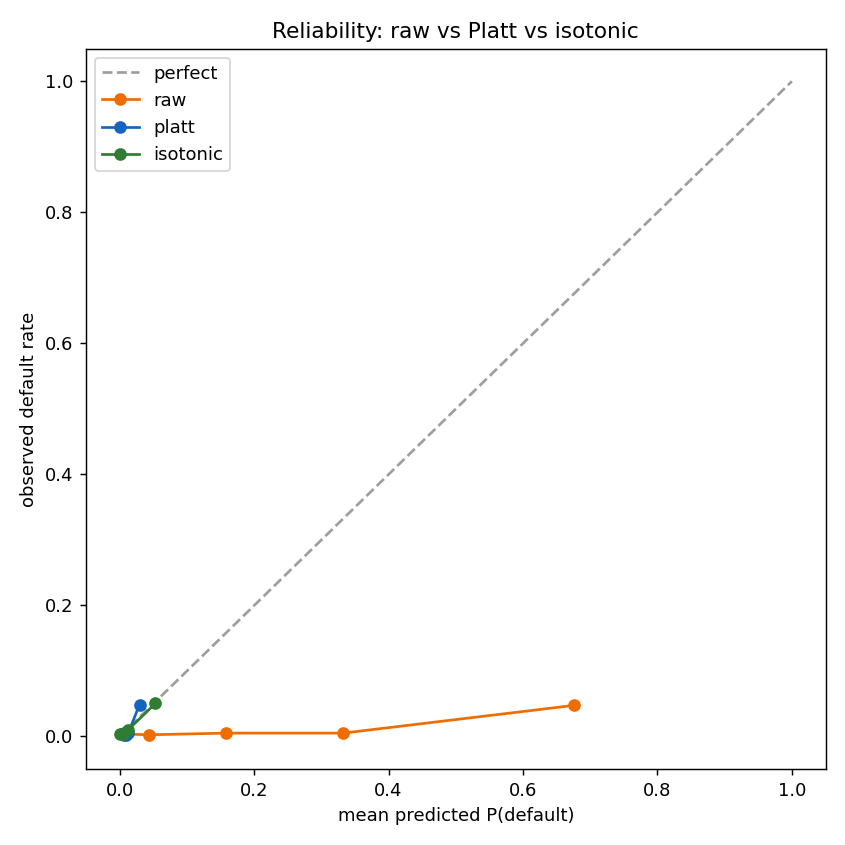
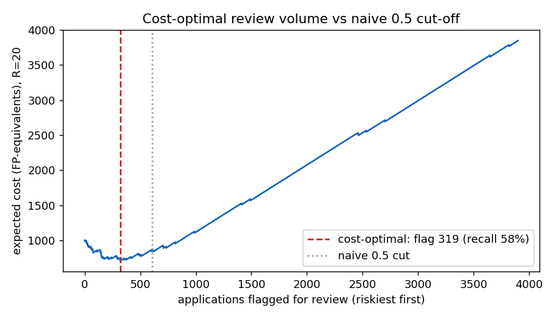
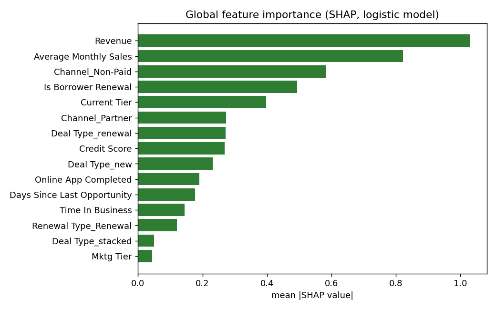
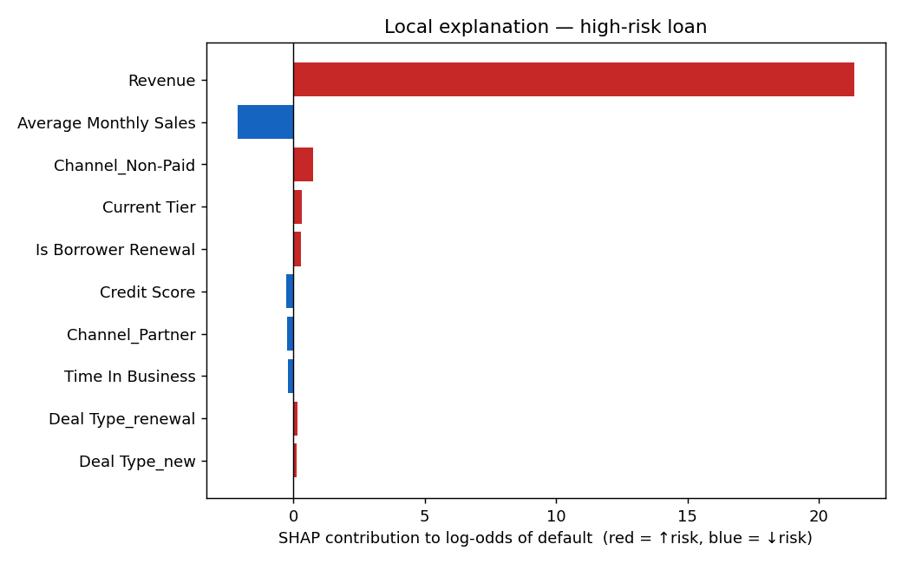

# 4. Results

## 4.1 Introduction

Results are reported in the order of the research questions, preceded by the feasibility findings
that shaped the design, and followed by the decision layer and the two non-estimability results.
Conventions throughout: CV metrics are the median with the [2.5th, 97.5th] fold-percentile band;
calibration metrics carry 95% bootstrap CIs; the PR-AUC prevalence floor under the primary label
is ≈ 0.0128.

## 4.2 Feasibility: what the data permits

The Phase 1 analysis established three facts that govern everything downstream. First, the event
count is 50 under *both* candidate label schemes (§3.3): no labelling choice mitigates small-N.
Second, censoring is severe and cohort-dependent — 72.8% of the dominant 2019 cohort is
unresolved (`current`) — justifying the censoring-safe primary label.

Third, the fairness go/no-go gate failed comprehensively: under the ≥10-events-per-cell
criterion, **0 of 27 industries and 0 of 51 states are estimable**. The best-populated cells
illustrate how far short the data falls — construction, the industry cell with the most events,
holds 9; the largest state cells (California, North Carolina) hold 5 each. This converted the
planned fairness audit into the documented non-estimability result reported in §4.7.

## 4.3 RQ1: model × imbalance bake-off

| Model + treatment | PR-AUC | Recall@top-decile | Within-minority ECE |
|---|---|---|---|
| dummy (floor) | 0.013 [0.013, 0.013] | 0.100 [0.000, 0.240] | 0.987 |
| LR + class weight | **0.117** [0.043, 0.242] | **0.600** [0.360, 0.900] | **0.305** [0.215, 0.548] |
| LR + SMOTE | 0.117 [0.043, 0.255] | 0.600 [0.300, 0.900] | 0.317 [0.214, 0.560] |
| XGBoost + class weight | 0.093 [0.038, 0.260] | 0.500 [0.300, 0.700] | 0.845 [0.675, 0.966] |
| XGBoost + SMOTE | 0.105 [0.039, 0.207] | 0.400 [0.300, 0.700] | 0.780 [0.636, 0.934] |

**Verdict: no significant winner.** The best gradient-boosted configuration (median PR-AUC
0.105) does not clear the logistic-regression median (0.117), and every fold band overlaps every
other. At ~10 events per test fold the data cannot separate these models, exactly as the
events-per-variable literature predicts at EPV ≈ 3.8 (Peduzzi et al., 1996; Riley et al., 2020).
This is reported as the finding RQ1 anticipated, not a failure: overlapping bands are stated as
overlapping.

A caveat on the verdict's scope: XGBoost runs untuned (§3.6 gives the principled reason — model
selection on ~10 positives per inner fold is itself noise), so the defensible statement is that
the comparison is *unpowered to detect* a winner, not that none exists; §5.2 develops this,
including the detection bound that makes tuning gains equally unverifiable here.

Two secondary observations carry forward. All four configurations sit roughly eight times above
the 0.013 prevalence floor — the features carry genuine signal (verified independently below) —
and logistic regression holds materially higher confidence on the minority class
(within-minority ECE 0.305 vs 0.845), which motivated both the choice of the served model and
RQ2's calibration investigation.

**The signal is real (evidence-of-learning checks).** These checks report *pooled out-of-fold*
PR-AUC — a single statistic over all OOF predictions, systematically lower than the fold-median
0.117 quoted above because pooling removes the optimistic half of fold variance; the two bases
are stated wherever they appear. Against 100 label-permutation reruns of
the full out-of-fold pipeline, the real model's pooled OOF PR-AUC of 0.095 exceeds every null
run (null mean 0.014, null maximum 0.034; p = 0.010). Across five CV seeds, PR-AUC is stable at 0.091 ± 0.002
and recall@top-decile at 0.604 ± 0.027. The learning curve plateaus by 75% of the data (0.096 at
75% vs 0.095 at 100%), consistent with a dataset too small to reward additional capacity. The
full model (PR-AUC 0.095) also clearly outperforms its best single feature: `Revenue` alone
scores 0.065, while `Credit Score` alone (0.0104) falls *below* the dummy floor (0.0128) — a
robust negative finding for the variable a credit dataset is nominally built around, though §5.5
identifies funded-book range restriction as an unexcluded alternative explanation.

**Robustness to cleaning.** Re-running the bake-off on raw versus cleaned data moves no
conclusion: the largest PR-AUC change across configurations is +0.014 (XGBoost + SMOTE), the
no-winner verdict is unchanged, and `Credit Score` remains at 0.0104 under both — its weakness is
a property of the feature, not of the 0-coded rows.

**One operational headline survives the uncertainty:** reviewing the riskiest decile catches on
the order of 60% of all defaults (fold band [0.36, 0.90]) — the cumulative-gains result that
makes the decision layer of §4.6 worth building.

## 4.4 RQ1 follow-up: can the model be improved, and what would it take?

**Experiment 1 — respecting the EPV budget.** L1-sparse and elastic-net logistic regression,
with and without domain affordability ratios (loan-to-revenue, loan-to-sales, revenue-to-sales;
Altman, 1968), against the L2 baseline. Note the basis change: these configurations use the 10
base numeric features only (hence the 0.122 baseline median, not the 17-feature bake-off's
0.117):

| Configuration | Median PR-AUC | Band width |
|---|---|---|
| LR L2, base numerics (baseline) | 0.122 | 0.189 |
| LR L1-sparse | 0.121 | 0.195 |
| LR L1-sparse + affordability ratios | 0.121 | 0.194 |
| LR elastic-net + affordability ratios | 0.123 | 0.192 |

Neither the median nor — more importantly — the uncertainty band moves. **This is the expected
null**: the fold band is dominated by sampling variance, which no model choice on the same 50
events can remove.

**Experiment 2 — the events projection.** Subsampling both classes at fixed prevalence (three
event counts — 25, 38, 50 — at three draws each) and fitting the standard `width ∝ 1/√events`
law projects that **on the order of 4–5× the current events (roughly 200–250) would be needed to
halve the uncertainty band**. The basis is disclosed plainly: three points whose widths are
non-monotone (0.215, 0.238, 0.155 — the middle point sits above the fitted curve), so the
projection is an order-of-magnitude planning figure derived from a theoretically motivated law,
not a precise requirement; under the exact 1/√events law the analytic answer is 4× = 200
events. (The 50-event width here, 0.155, comes from the three-draw subsampling design and is not
comparable to Experiment 1's 25-fold band of 0.189.) The direction of the conclusion does not
depend on the fit: the lever for a materially better model is data acquisition, not modelling.

## 4.5 RQ2: calibration — marginal and minority objectives conflict

Class-weighted training inflates predicted probabilities: the raw model's Brier score of 0.122
is an order of magnitude worse than the prevalence-only predictor (≈ 0.0127), even though the
model ranks well. Post-hoc calibration was therefore mandatory. The result:

| Calibration | Brier [95% CI] | Within-minority ECE [95% CI] |
|---|---|---|
| raw | 0.1220 [0.1157, 0.1288] | 0.347 [0.256, 0.441] |
| Platt | 0.0122 [0.0092, 0.0156] | 0.969 [0.964, 0.974] |
| isotonic | 0.0128 [0.0099, 0.0161] | 0.942 [0.921, 0.958] |

Platt scaling repairs the marginal Brier score (0.122 → 0.012, at the base-rate level) — and
simultaneously **nearly triples the event-level calibration error** (0.347 → 0.969, CIs
disjoint). Interpreting this honestly requires the metric's definition (§3.6): computed on
events only, within-minority ECE reduces to the mean confidence shortfall on actual defaults,
so what the table measures is a *structural* trade-off — any recalibration that pulls
probabilities toward a 1.28% base rate must, for a model with imperfect discrimination, collapse
confidence on the rare positives. The conflict is therefore inherent to low-prevalence
recalibration rather than a surprising empirical accident; the contribution of RQ2 is measuring
its severity at this extreme operating point (near-total: 0.969 means recalibrated confidence on
actual defaults averages ~3%) and drawing the operational consequence: **a marginally
"well-calibrated" rare-event model can be worthless on exactly the cases that matter.** The
served system accordingly reports the model's score as a ranking quantity, and the decision
layer (§4.6) selects its threshold empirically rather than trusting the probability scale.

**Split-conformal prediction** achieves essentially exact marginal coverage (0.900 observed at
nominal 0.90, sd 0.017; 0.951 at 0.95) — and the mean prediction-set sizes (1.15 and 1.43) show
why this guarantee carries almost no information here: a set containing only the majority class satisfies
marginal coverage at 1.28% prevalence. The result is reported as the honest transparency
artefact the protocol pre-specified it as, demonstrating that a formally attractive guarantee
can be substantively empty at extreme imbalance.

## 4.6 The decision layer: what 50 events does support

The expected-cost policy (§3.10) turns the ranking into a review queue. Across cost ratios, the
policy behaves as decision theory requires — as a missed default becomes costlier, the threshold
falls, the queue grows, and recall climbs:

| R | Threshold | Flagged | Defaults caught | Recall | Cost saved vs 0.5 cut |
|---|---|---|---|---|---|
| 5 | 0.998 | 27 | 5/50 | 0.10 | 61.3% |
| 10 | 0.974 | 76 | 12/50 | 0.24 | 37.4% |
| 20 | 0.676 | 319 | 29/50 | 0.58 | 16.4% |
| 50 | 0.452 | 732 | 40/50 | 0.80 | 6.1% |
| 100 | 0.426 | 816 | 41/50 | 0.82 | 14.9% |

The saving column is not monotone in R (6.1% at R = 50, 14.9% at R = 100) because it is a ratio
to a baseline whose own quality moves with R — the non-monotonicity belongs to the 0.5-cut
denominator, not to the policy, whose absolute cost is monotone.

At the illustrative R = 20, the cost-optimal policy flags 319 applications (versus 605 under a
naive 0.5 cut), catches 29 of 50 defaults, and reduces expected cost by 16.4%. Bootstrapping the
out-of-fold rows (500 resamples) puts the saving at **19.0% [7.9, 32.8]**. The procedure matters
and is stated: the threshold is **re-selected inside every resample**, so the interval
propagates threshold-selection uncertainty rather than treating the chosen cut as fixed.
Because selection and evaluation share each resample, the interval's *location* retains
in-sample optimism — the true saving may lie below the quoted bounds; the interval is evidence
that the saving is unlikely to be zero, not a guarantee of its size. Against the operationally
natural baseline — the top-decile rule the demo itself serves — the advantage at R = 20 is far
more modest: **3.9%** on the full data, bootstrap **6.8% [1.2, 19.4]** under the same
per-resample re-selection (and the same location caveat, which bites harder when the lower
bound is 1.2). Most of the headline saving therefore reflects how bad the 0.5 cut is on
inflated probabilities; the honest summary is that the decile rule is already close to
cost-optimal at moderate R — the expected-cost machinery's demonstrated advantage over it is
small, and its real contribution is *deriving* the queue depth from stated costs rather than
fixing it by convention. Two further caveats are part of the result: R is the desk's parameter,
not the analyst's (hence a sensitivity curve, not a single threshold), and the improvement is
to *decisions*, not discrimination — PR-AUC is untouched.

## 4.7 Non-estimability results

**Group-conditional fairness is non-estimable at the audit's granularity.** No industry cell
(0/27) and no state cell (0/51) reaches ten events; the largest cell anywhere holds nine. Any
equalised-odds or predictive-parity estimate on such cells would be noise wearing the vocabulary
of an audit, and reporting one would be less responsible than reporting none. Two boundaries of
this verdict are stated rather than implied. First, it is granularity-specific: coarser
partitions (e.g. a handful of industry sectors or census regions, ~12 events per cell) or
hierarchical estimation with honest pooling could clear the gate, at the price of averaging away
exactly the group distinctions an audit exists to detect — a trade-off flagged as future work,
not resolved here. Second, the dataset contains no protected characteristics; industry and
state are proxies, so even a fully estimable audit on these fields would be a proxy audit. The
protocol's contribution is the gate itself (§3.9): the audit *design* is specified, the data
failed its entry condition, and the evidence is documented. What would unlock it is quantified
in Chapter 7.

**Survival modelling of the censored book is non-estimable.** The 10,124 censored `current`
loans motivated a time-to-event feasibility check before any Cox model was fitted. The dataset
offers two candidate duration measures — calendar (`End − Start`) and term-based
(`Closed Max Term × Term Complete %`) — and they **correlate at −0.02**: they cannot both be
measuring elapsed loan life, and in fact neither is. 89.9% of `paidOff` loans sit below 90%
term-complete (a genuinely paid-off loan should be near 100%), and 75.6% of `current` loans show
a calendar span under one month — implausible for 2015–2019 originations observed at a ~2020
snapshot, indicating that `End` records an administrative booking date rather than maturity or
default. **No survival model was fitted**: estimating hazards on a meaningless time axis would
produce meaningless numbers. A single reliable field — a default date or last-payment date per loan —
would reverse this verdict.

These two results are deliberately reported *as results*. Both follow the same discipline: state
the entry condition a method requires, test it empirically, and publish the failure with its
evidence rather than proceeding to an unestimable estimate.

## 4.8 RQ3: explainability

Exact linear SHAP attributions, aggregated to named source features, give the global importance
ranking:

| Rank | Feature | mean \|SHAP\| |
|---|---|---|
| 1 | Revenue | 1.030 |
| 2 | Average Monthly Sales | 0.822 |
| 3 | Channel (non-paid) | 0.583 |
| 4 | Is Borrower Renewal | 0.494 |
| 5 | Current Tier | 0.398 |
| 8 | Credit Score | 0.268 |

Three findings answer RQ3's first half affirmatively, with one honest boundary. **Coherence:**
global SHAP importance correlates 0.61 with the model's absolute coefficients — for a linear
model, SHAP importance is the coefficient weighted by each feature's spread, so
positive-but-imperfect correlation is the mathematically expected behaviour, and the
explanations are faithful to the model by construction rather than post-hoc storytelling. The
boundary: faithfulness to the model does not certify the model's coefficients themselves, which
at EPV ≈ 3.8 carry sampling instability (§2.4) — and `Revenue` and `Average Monthly Sales` are
correlated, so linear attribution divides credit between them in a way that is partly arbitrary.
A cross-fold stability check was therefore run (`reports/followup_checks.md`): recomputing the
global importance ranking independently in each of five folds gives a mean pairwise Spearman
correlation of **0.89** (minimum 0.80); `Revenue` sits in the top three in **100%** of folds and
`Average Monthly Sales` in 80%, while the affordability cluster holds outright rank 1 in only
60% of folds. The global *ordering* is therefore not a seed artefact, but the defensible unit
of explanation remains the affordability *cluster* rather than a single champion feature — and
per-applicant codes on borderline cases still inherit the coefficient noise EPV predicts. **Corroboration:** `Revenue` ranks first, consistent with the
single-feature baselines (§4.3) where it was the only feature clearing the floor unaided, and
`Credit Score`'s low rank matches its below-floor solo performance — the explanation layer and
the evaluation layer tell the same story about the same data. **Decision legibility:** each
prediction decomposes into signed, named contributions rendered as plain-English reason codes
("Monthly revenue — raises risk") in the served application, the artefact shape appropriate to an
adverse-action account (Wachter et al., 2017), with the jurisdictional caveats discussed in
Chapter 6.

RQ3's second half — where group-level fairness claims become non-estimable — is answered in full
by §4.7: at this event count, at every cell of the audit's chosen granularity.

## 4.9 Summary

The chapter's verdicts restate briefly. The model-by-treatment bake-off produced no significant
winner: every fold band overlaps every other, while the evidence-of-learning checks confirm the
signal itself is real (permutation p = 0.010). Calibration exposed a structural trade-off,
measured here at an extreme operating point: repairing the marginal Brier score collapses the
model's confidence on the actual defaults. The decision layer's saving is robust against the
naive 0.5 cut-off and modest against the top-decile rule. Group-conditional fairness and survival
modelling are both non-estimable, and each verdict is documented with its evidence. Explainability
identified the affordability cluster as the dominant risk signal, an ordering stable across folds.
