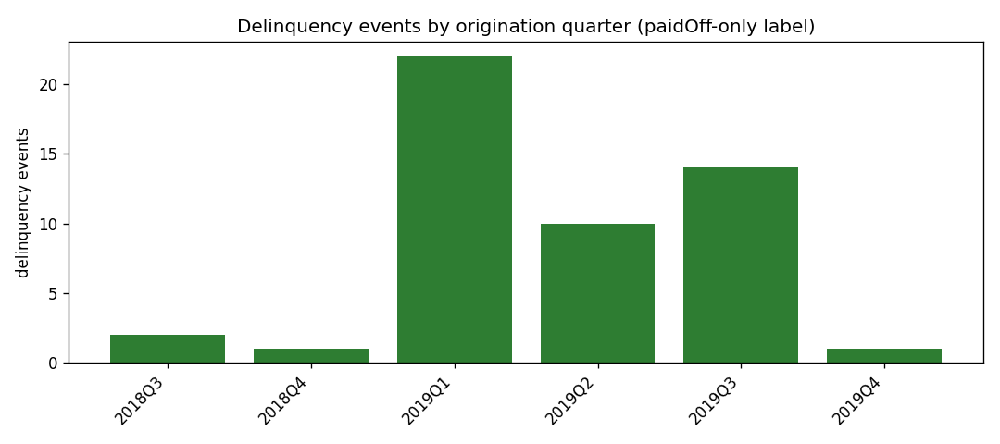
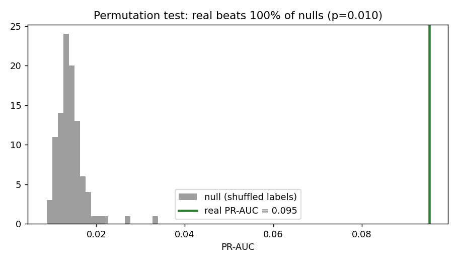
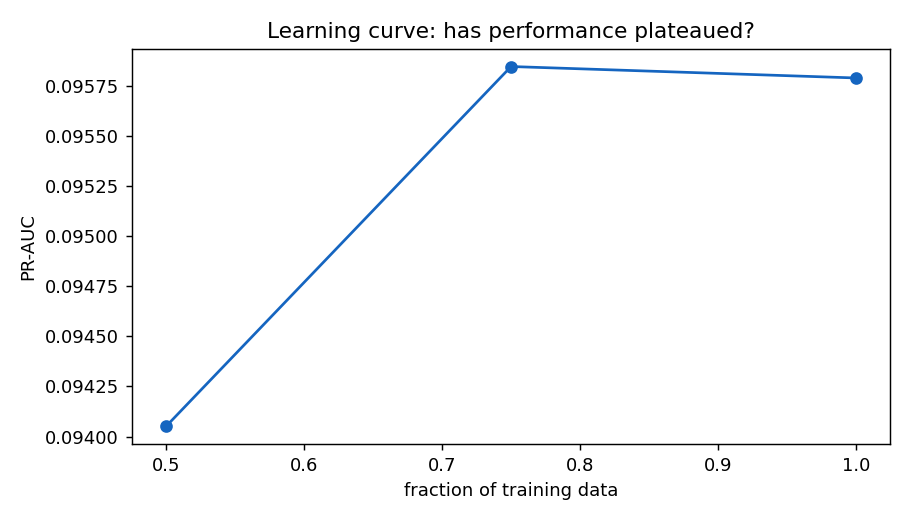
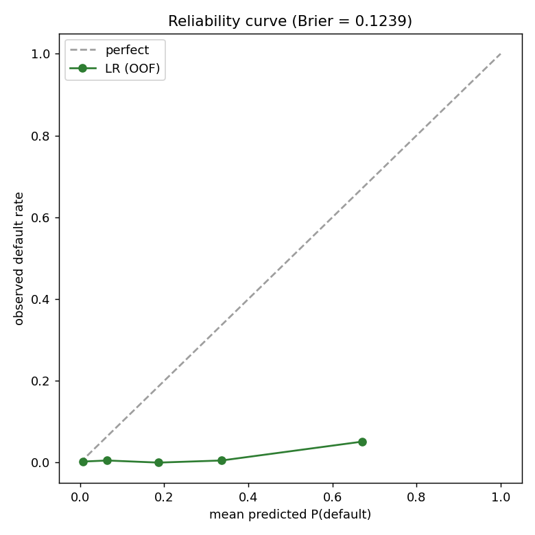
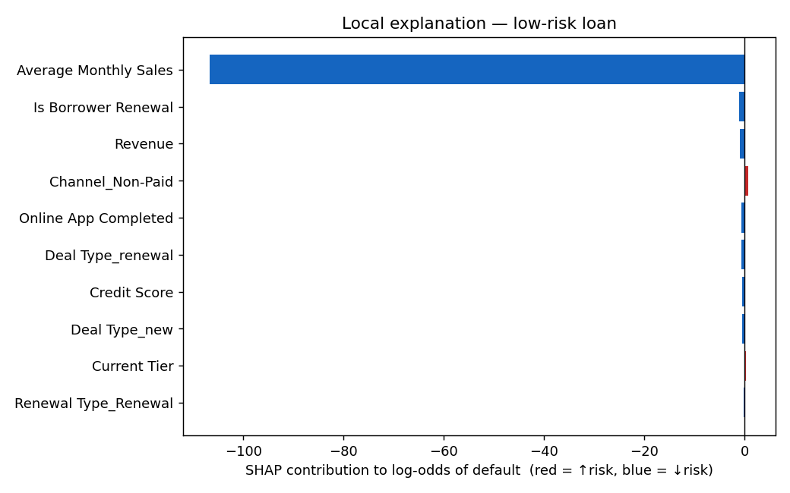
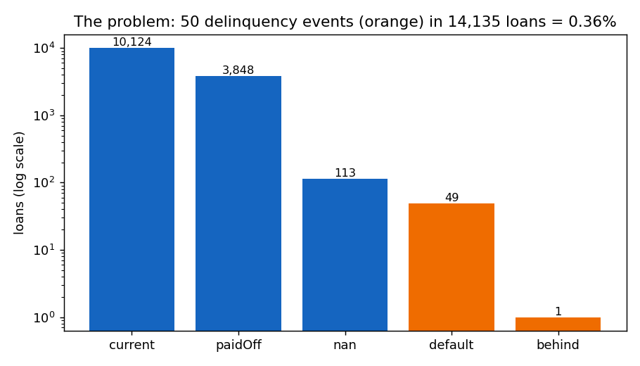
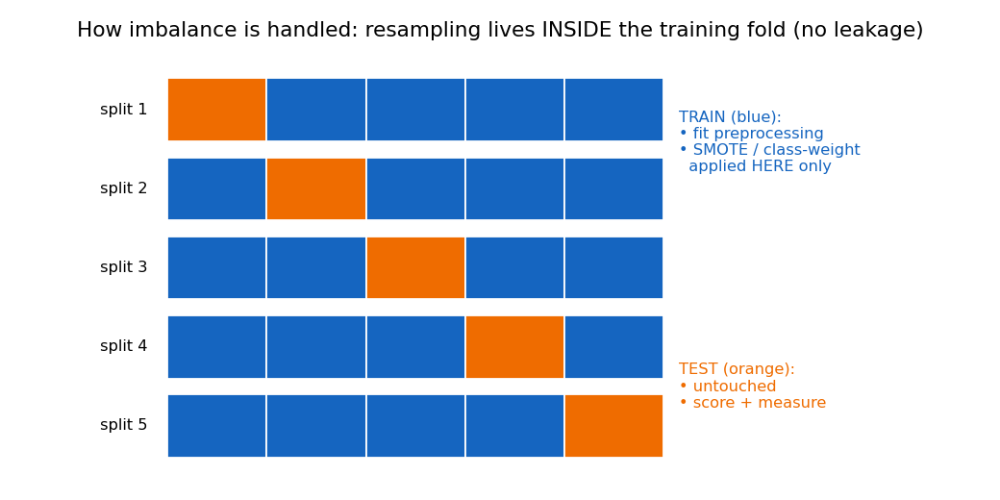

# Appendices

## Appendix A: Ethics training evidence

The University requires evidence that the researcher has completed the mandatory research-ethics
and research-integrity training before data analysis begins.

*[Insert the completion certificate(s) here: the Moodle/WMG research-integrity module completion
record showing the candidate's name, the module title and the completion date. A screenshot of
the completion page or the emailed certificate is sufficient.]*

| Requirement | Evidence to attach |
|---|---|
| Research integrity / ethics module | Completion certificate or Moodle transcript entry |
| Data-protection (GDPR) awareness, where required by the course | Completion record |
| Date completed | Must precede the start of data analysis |

## Appendix B: Ethical approval / waiver confirmation

### B.1 Ethical basis of the study

This project analyses a pre-existing, anonymised commercial lending dataset (14,135 funded
green-loan records). It involves no human participants, no recruitment, no intervention, and no
collection of new data. The dataset contains no direct personal identifiers: the modelling
features are firmographic and financial (credit score, revenue, sales, time in business,
industry, state), and no name, address, contact detail, or account identifier is used at any
stage. The leakage audit (Chapter 3, Appendix C) further restricts the model to 17 pre-funding
attributes. On this basis the study falls within the scope normally granted a low-risk
secondary-data-analysis waiver under the University's research-ethics framework.

### B.2 Ethics self-assessment

| Question | Response |
|---|---|
| Does the research involve human participants? | No. The study analyses records of completed commercial loan agreements. |
| Is new data collected from individuals? | No. The dataset is a pre-existing export supplied for research use. |
| Does the data contain personal identifiers? | No direct identifiers. Records describe businesses, not named individuals, and no name, address, contact detail or account number is used. |
| Is any special-category data processed? | No. No data on health, ethnicity, religion, political opinion, biometrics or sexual orientation is present or inferred. |
| Could individuals be re-identified? | Re-identification is not attempted and no output is published at record level. All reported results are aggregate; the deployed model contains no row-level data (Appendix E). |
| Is consent required? | Not applicable: no participants are involved and the data was supplied by the data controller for this purpose. |
| Where is the data stored? | On the researcher's institutionally managed device only. It is excluded from the public code repository's deployment artefacts and from the container image (`.dockerignore`). |
| How long is it retained? | For the duration of the assessment period, after which the local copy is deleted in line with University guidance. |
| Are there risks to the data provider? | The commercial sensitivity of the portfolio is respected: the lender is not named, and no record-level output is published. |
| Does the work carry societal risk? | The model ranks applications for human review and does not approve or decline. Its limitations, including unreliable minority-class probabilities and the non-estimability of a fairness audit, are stated explicitly (Chapters 4 and 6) precisely to prevent inappropriate reliance. |

### B.3 Confirmation

*[Insert the University/WMG ethical-approval reference number, or the confirming email or waiver
decision for a secondary-data project, in the space below. If the project was assessed as
exempt, attach that confirmation.]*

| Item | Value |
|---|---|
| Ethical approval / waiver reference | *[to be inserted]* |
| Date of decision | *[to be inserted]* |
| Approving body | *[e.g. WMG Research Ethics Committee]* |

## Appendix C: The permitted feature set

The 17 pre-funding features admitted by the default-deny leakage audit (10 numeric,
7 categorical). The full audit trail, including the exclusion reason for each of the ~148
forbidden columns, is versioned at `data/governance/feature_catalogue.yaml`.

| Feature | Type | Plain-English label (as served) |
|---|---|---|
| Credit Score | numeric | Credit score |
| Amount Sought | numeric | Loan amount requested |
| Revenue | numeric | Monthly revenue |
| Average Monthly Sales | numeric | Monthly sales |
| Time In Business | numeric | Time in business |
| Days Since Last Opportunity | numeric | Days since last enquiry |
| Online App Completed | numeric | Applied online |
| Is Borrower Renewal | numeric | Returning borrower |
| Current Tier | numeric | Risk tier |
| Mktg Tier | numeric | Marketing tier |
| Industry | categorical | Industry |
| Loan Purpose | categorical | Loan purpose |
| Borrower State | categorical | Borrower's state |
| Deal Type | categorical | Deal type |
| Renewal Type | categorical | Renewal type |
| Channel | categorical | Origination channel |
| Medium | categorical | Marketing medium |

## Appendix D: Reproduction instructions

Every figure and number in this dissertation regenerates from a clean checkout with the commands
below (Windows-first; global seed 20260609 is set in `emerald_ai/config.py`).

```powershell
pip install -r requirements.txt

python -m emerald_ai eda              # Ch.4 §4.2  -> reports/feasibility.md
python -m emerald_ai audit            # Ch.3 §3.4  -> data/governance/
python -m emerald_ai clean-report     # Ch.3 §3.5  -> reports/data_quality.md
python -m emerald_ai bakeoff          # Ch.4 §4.3  -> reports/model_bakeoff.md
python -m emerald_ai evidence         # Ch.4 §4.3  -> reports/learning_evidence.md
python -m emerald_ai sensitivity      # Ch.4 §4.3  -> reports/sensitivity_cleaning.md
python -m emerald_ai improve          # Ch.4 §4.4  -> reports/improvement.md
python -m emerald_ai calibrate        # Ch.4 §4.5  -> reports/calibration.md
python -m emerald_ai decide           # Ch.4 §4.6  -> reports/decision_policy.md
python -m emerald_ai survival-check   # Ch.4 §4.7  -> reports/survival_feasibility.md
python -m emerald_ai explain          # Ch.4 §4.8  -> reports/explainability.md
python -m emerald_ai followup-checks  # Ch.5 §5.2/§5.5, Ch.4 §4.8 -> reports/followup_checks.md
python -m emerald_ai figures          # visual story -> reports/visual_story.md

python -m pytest -q                   # 59 tests

python -m emerald_ai serve            # Ch.3 §3.11 demo -> http://127.0.0.1:8000
```

This document itself is compiled from the Markdown chapters in `docs/dissertation/` by
`python docs/dissertation/build.py`.

## Appendix E: Decision-support application

The served application (`python -m emerald_ai serve`) was run and verified for this submission:
the model trains on start-up, the operating point is set from out-of-fold scores
(P ≥ 0.617, 62% default catch-rate), and all four endpoints respond as designed (single-applicant
scoring, pasted-CSV batch, file upload, and the rejection path for malformed uploads). The batch
review queue is the primary interface: an uploaded CSV/Excel file is ranked by risk and the
riskiest within-batch decile is flagged for review; the single-application panel provides
per-decision SHAP reason codes and what-if analysis on the plain-English feature form.

The transcript below is the actual output of a session against the running service, reproducible
with `python -m emerald_ai serve`. Screenshots of the same four interactions are inserted after
it.

**(i) Readiness probe.** `GET /health`, unauthenticated, reports the served operating point:

```json
{"status": "ok", "model_loaded": true, "ready": true, "cache_present": true,
 "auth_required": false, "operating_threshold": 0.6165, "catch_rate": 0.62,
 "training_rows": 3898, "training_events": 50}
```

**(ii) Single application (the explain panel).** An applicant with a thin file and high revenue
scores 99.28%, above the review threshold, with the three signed reasons a reviewer would act on:

```
percent = 99.28   in_riskiest_decile = True   threshold = 0.6165
  Monthly revenue    raises risk   (value 9,000)
  Deal type          raises risk   (value new)
  Returning borrower raises risk   (value 0)
```

**(iii) Batch review queue (the primary interface).** Twelve applications uploaded as a file;
the service ranks them and flags the riskiest decile of that batch (two applications) for review:

| rank | id | percent | in queue | top reasons |
|---|---|---|---|---|
| 1 | app_0004 | 93.54 | yes | ↑ Monthly revenue, ↓ Days since last enquiry, ↑ Monthly sales |
| 2 | app_0000 | 62.25 | yes | ↑ Monthly revenue, ↑ Monthly sales, ↓ Applied online |
| 3 | app_0006 | 38.43 | no | ↓ Monthly revenue, ↑ Monthly sales, ↑ Origination channel |
| 4 | app_0011 | 37.45 | no | ↓ Monthly revenue, ↑ Monthly sales, ↑ Origination channel |
| 5 | app_0009 | 29.23 | no | ↑ Monthly sales, ↑ Origination channel, ↑ Deal type |

**(iv) Rejected uploads.** Both failure paths return a clean, explanatory HTTP 400 rather than a
stack trace:

```
POST /api/score-upload  (book.pdf)
  400  {"detail": "unsupported file type; expected one of ('.csv', '.xlsx', '.xls')"}

POST /api/score-upload  (a CSV with no permitted columns)
  400  {"detail": "no recognised applicant columns found in the uploaded data"}
```

*[Insert screenshots of the same four interactions, captured on the submission machine with
`python -m emerald_ai serve` at http://127.0.0.1:8000: the batch review queue with its ranked
table and highlighted queue rows; the single-application panel with its score and reason codes;
and the error message shown by the interface when a malformed file is uploaded.]*

API surface: `GET /` (UI), `GET /health` (readiness probe), `POST /api/score` (single
applicant), `POST /api/score-batch` (pasted CSV), `POST /api/score-upload` (file upload).
Hardening: structured request logging (no applicant field values logged), upload validation
(extension allowlist, 10 MB cap, parse and column checks returning HTTP 400), a global exception
handler (generic HTTP 500, no traceback leakage), and optional static API-key auth on `/api/*`
via the `EMERALD_API_KEY` environment variable (default-open for examination use).

**Deployment.** The service ships as a container (`Dockerfile`, `docker-compose.yml`):

```powershell
docker compose up --build        # -> http://127.0.0.1:8000
```

| Property | Implementation |
|---|---|
| Dataset kept out of the image | `.dockerignore` excludes `*.xlsx`; the book is mounted read-only at run time |
| Immediate restarts | fitted model cached to `artefacts/scorer.joblib`; measured 20.3 s cold fit vs 0.02 s cached load |
| Stale-model safety | cache keyed by code path and seed; ignored (and refitted) when either changes |
| Readiness probing | `GET /health`, unauthenticated and non-blocking: HTTP 503 with `ready:false` during the first fit, then 200 with the operating point |
| Least privilege | container runs as uid 10001 with write access only to the cache directory |

A sample healthy response:

```json
{"status": "ok", "model_loaded": true, "ready": true, "cache_present": true,
 "auth_required": false, "operating_threshold": 0.6165, "catch_rate": 0.62,
 "training_rows": 3898, "training_events": 50}
```

## Appendix F: Supplementary figures














