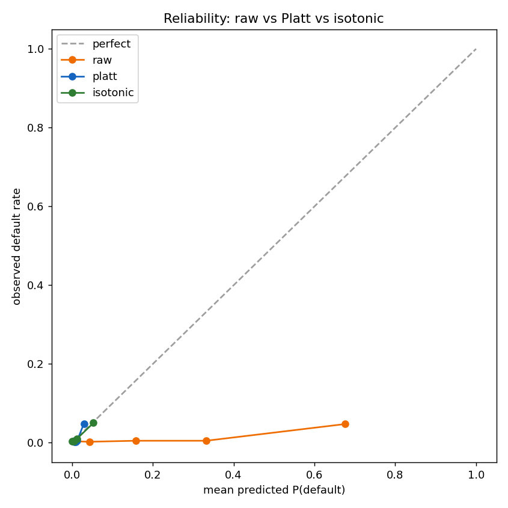

# Phase 4a — Calibration & Conformal (RQ2)

*Generated by `python -m emerald_ai calibrate`, seed 20260609, label paidoff_only
(prevalence 0.0128, 50 events). Calibrators fit on a held-out slice inside each
CV fold; metrics are out-of-fold with 2,000-sample bootstrap CIs.*

## Calibration metrics (raw vs Platt vs isotonic)
| index | calibration | Brier [95% CI] | within-min ECE [95% CI] |
| --- | --- | --- | --- |
| 0 | raw | 0.1220 [0.1157, 0.1288] | 0.347 [0.256, 0.441] |
| 1 | platt | 0.0122 [0.0092, 0.0156] | 0.969 [0.964, 0.974] |
| 2 | isotonic | 0.0128 [0.0099, 0.0161] | 0.942 [0.921, 0.958] |

Base-rate (prevalence-only) Brier ≈ 0.0127.

## RQ2 verdict (honest)
- **Marginal Brier:** 0.1221 (raw) → 0.0123 (platt). Post-hoc calibration
  substantially improves
  the marginal Brier, pulling the inflated class-weighted probabilities back toward the base rate.
- **Within-minority ECE:** 0.349 (raw) → 0.969 (platt).
  **Calibration does NOT help (and may hurt) within-minority ECE** — pulling probabilities down for marginal Brier lowers confidence on the rare defaults. This is the proposal’s core point: marginal calibration and minority calibration are different objectives, and ~50 events cannot satisfy both.

## Split-conformal coverage (transparency, not precision)
Manual LAC split-conformal [Angelopoulos & Bates 2023], 30 repeated 60/20/20 splits:
| index | nominal | coverage | coverage_sd | mean_set_size |
| --- | --- | --- | --- | --- |
| 0 | 0.9 | 0.9 | 0.017 | 1.146 |
| 1 | 0.95 | 0.951 | 0.01 | 1.427 |

At 1.28% prevalence, marginal coverage is near-vacuous — a set that always contains
the majority class trivially achieves it; mean set size shows how often the set collapses to a
single label. Reported as an honest small-N transparency artefact, as the roadmap frames it.

---
*Reproduce: `python -m emerald_ai calibrate`*
