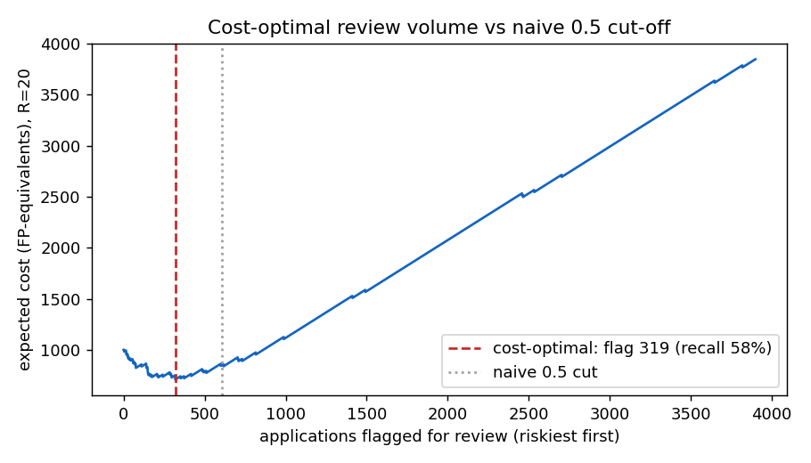

# Cost-sensitive decision policy (option b)

*Generated by `python -m emerald_ai decide`, seed 20260609, label paidoff_only
(50 events / 3898 rows). Threshold chosen on out-of-fold scores by minimising
`cost(t) = R·FN(t) + FP(t)`; R = cost(missed default) / cost(needless review).*

## Optimal review policy across cost ratios
| index | cost_ratio_R | opt_threshold | n_flagged | defaults_caught | recall | precision | cost_vs_0.5_%saved |
| --- | --- | --- | --- | --- | --- | --- | --- |
| 0 | 5 | 0.9982 | 27 | 5/50 | 0.1 | 0.1852 | 61.3 |
| 1 | 10 | 0.9741 | 76 | 12/50 | 0.24 | 0.1579 | 37.4 |
| 2 | 20 | 0.6763 | 319 | 29/50 | 0.58 | 0.0909 | 16.4 |
| 3 | 50 | 0.4516 | 732 | 40/50 | 0.8 | 0.0546 | 6.1 |
| 4 | 100 | 0.4261 | 816 | 41/50 | 0.82 | 0.0502 | 14.9 |

- **opt_threshold** — risk cut-off that minimises expected cost (NOT 0.5, NOT a fixed decile).
- **n_flagged / recall** — how many applications enter the review queue and the share of defaults caught.
- **cost_vs_0.5_%saved** — expected-cost reduction against the naive 0.5 cut-off.

As R rises (a missed default hurts more), the optimal threshold falls, the queue grows, and recall
climbs — the policy trades cheap reviews for caught defaults exactly as a lender would want.

## Does it actually work? (robustness at 50 events)
At **R = 20**, the cost-optimal policy flags **319** applications
(vs **605** under a 0.5 cut), catches **29/50**
defaults, and cuts expected cost by **16.4%**.

Bootstrapping the OOF rows (500 resamples), the cost saving vs the 0.5 cut is
**19.0% [7.9, 32.8]** (95% interval).
**Verdict: the saving is robust — the interval stays above zero, so the policy genuinely beats the naive cut despite the 50-event noise.**

## Honest limitations
- **R is unknown.** We report a range and a sensitivity curve, not one threshold; the desk must
  supply its own FN:FP cost ratio. The *method* is the contribution, not a single number.
- **Probabilities are miscalibrated**, so the threshold is chosen empirically on OOF scores rather
  than from the analytic `1/(1+R)`; calibrating first (Phase 4) would change the absolute cut but
  not the policy logic.
- **50 events** still bound everything: the chosen threshold itself has sampling uncertainty (the
  bootstrap above quantifies it). This improves *decisions*, not discrimination (PR-AUC is unchanged).

## Method → citation audit (Rule 1)
| Method | Status | Paper(s) |
|---|---|---|
| Cost-sensitive treatment of imbalance | **COVERED** | Xia, Liu & Liu 2017 `W2700766797` **[CURATED]** (D5) |
| Expected-cost threshold selection | **COVERED** | Elkan 2001 `W167016754` — **[CURATED]** (D14) |

---
*Reproduce: `python -m emerald_ai decide`*
