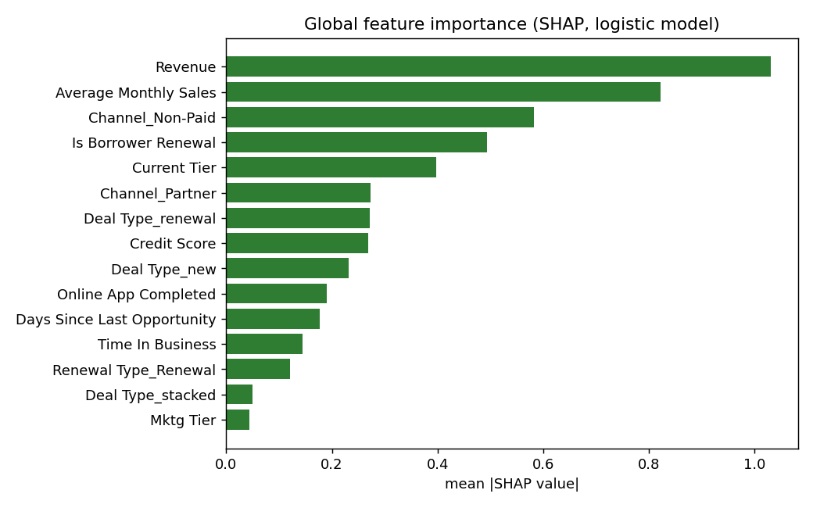
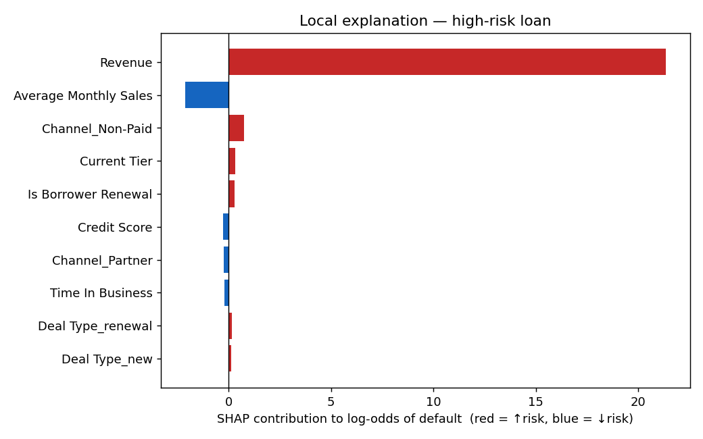
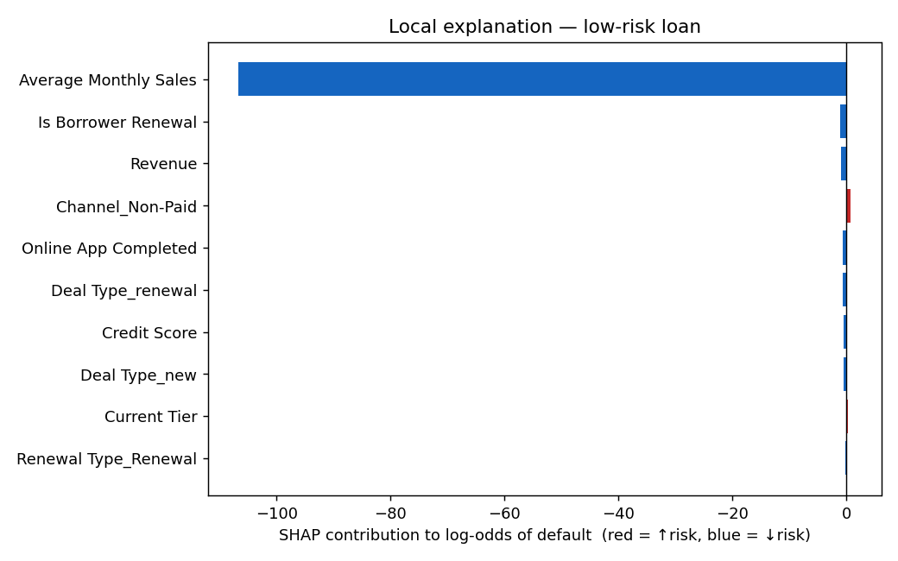

# Phase 4b — SHAP Explainability (RQ3)

*Generated by `python -m emerald_ai explain`, seed 20260609. Method: shap.LinearExplainer. Model: regularised
logistic regression on the 25 leakage-safe encoded features; label paidoff_only.*

## Global importance (top 8)
| index | feature | mean|SHAP| |
| --- | --- | --- |
| 0 | Revenue | 1.0303 |
| 1 | Average Monthly Sales | 0.8218 |
| 2 | Channel_Non-Paid | 0.5826 |
| 3 | Is Borrower Renewal | 0.4944 |
| 4 | Current Tier | 0.3976 |
| 5 | Channel_Partner | 0.2739 |
| 6 | Deal Type_renewal | 0.2711 |
| 7 | Credit Score | 0.2683 |

## Local explanations
A flagged **high-risk** loan (predicted P(default) = 1.00) and a **low-risk** loan
(0.000). Red bars push toward default, blue away — the "why was this loan flagged?"
answer a regulator (FCA Consumer Duty) expects.

## RQ3 verdict
- **Coherence:** SHAP global importance correlates **0.61** with the model's |coefficients|.
  For a linear model SHAP = coefβ·(x − E[x]), i.e. importance is the coefficient *weighted by each
  feature's spread* — so a positive-but-imperfect correlation is the **expected, correct** behaviour
  (a large coefficient on a near-constant feature rightly gets little SHAP credit), not a fault.
  The explanations are faithful, not post-hoc story-telling.
- **Corroborates earlier evidence:** `Revenue` ranks **#1** by SHAP — consistent with the
  single-feature finding (Revenue PR-AUC 0.065, the workhorse) and with `Credit Score` being weak.
- Explanations are **decision-legible**: each prediction decomposes into signed, named feature
  contributions suitable for an adverse-action notice.

---
*Reproduce: `python -m emerald_ai explain`*
