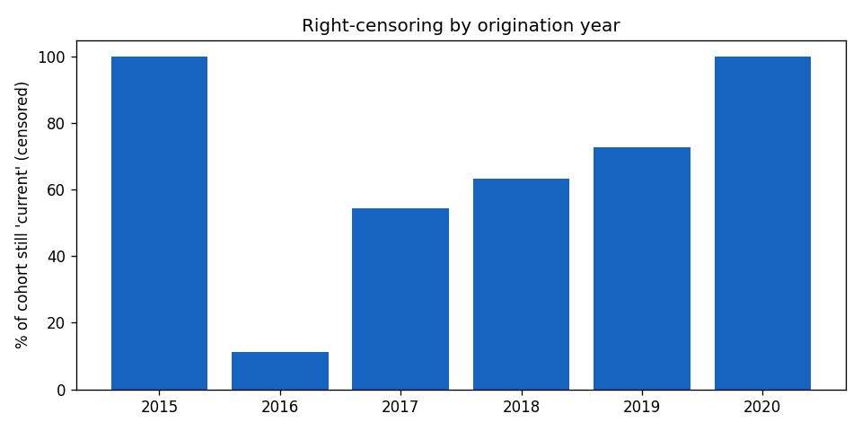
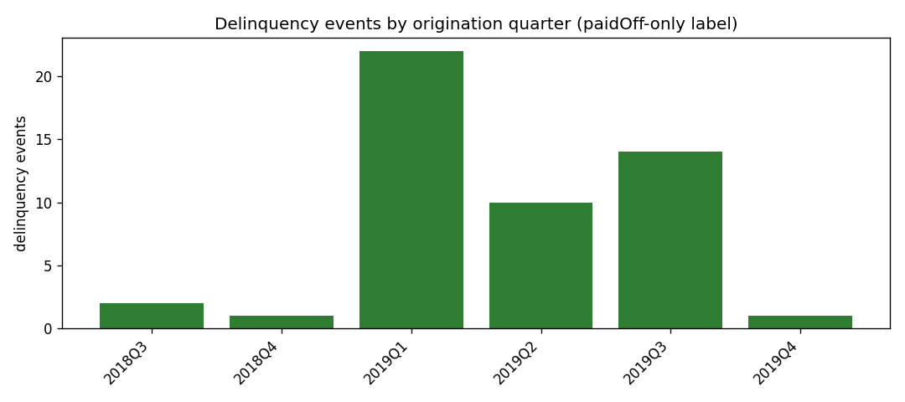

# Phase 1 — Imbalance & Censoring Feasibility Report

*Auto-generated by `python -m emerald_ai eda` — every number is computed from the raw data,
seed = 20260609. Do not edit by hand.*

## 1. The binding constraint
Label column `Deal Status`:

```
Deal Status
current    10124
paidOff     3848
NaN          113
default       49
behind         1
```

Delinquency = `default` ∪ `behind`. **The event count, not the ratio, is the constraint.**

## 2. Label scheme — prevalence under both constructions
| index | scheme | n_total | n_events | n_nonevents | prevalence_pct |
| --- | --- | --- | --- | --- | --- |
| 0 | all_favourable | 14022 | 50 | 13972 | 0.357 |
| 1 | paidoff_only | 3898 | 50 | 3848 | 1.283 |

`paidoff_only` is the **primary** label: it drops the right-censored `current` rows. Note the
event count barely moves between schemes — dropping censored rows fixes the *ratio*, never the
*count*. No labelling choice solves the small-N problem.

## 3. Right-censoring by origination cohort
The dataset is "2019 funded" but origination (`Start`) spans
2015–2020. Later cohorts have shorter observation windows,
so their `current` share is mechanically higher — this is the censoring threat to the label.

| orig_year | behind | current | default | paidOff | n | pct_current_censored | delinq_pct_of_terminal |
| --- | --- | --- | --- | --- | --- | --- | --- |
| 2015 | 0 | 1 | 0 | 0 | 1 | 100.0 |  |
| 2016 | 0 | 1 | 0 | 8 | 9 | 11.1 | 0.0 |
| 2017 | 0 | 24 | 0 | 20 | 44 | 54.5 | 0.0 |
| 2018 | 0 | 531 | 3 | 303 | 837 | 63.4 | 0.98 |
| 2019 | 1 | 9555 | 46 | 3517 | 13119 | 72.8 | 1.32 |
| 2020 | 0 | 12 | 0 | 0 | 12 | 100.0 |  |




## 4. Fairness feasibility (THE go/no-go decision)
Group-conditional fairness metrics need events *within each group cell*. Threshold for
"estimable" = **≥ 10 events** (primary label).

**By Industry** — 0 of 27 groups estimable:
| Industry | n | events | prevalence_pct | estimable |
| --- | --- | --- | --- | --- |
| construction | 629 | 9 | 1.43 | False |
| restaurants | 401 | 8 | 2.0 | False |
| other | 797 | 8 | 1.0 | False |
| manufacturing | 118 | 6 | 5.08 | False |
| informationMedia | 160 | 3 | 1.88 | False |
| freightTrucking | 159 | 3 | 1.89 | False |
| transportation | 161 | 3 | 1.86 | False |
| realEstate | 171 | 2 | 1.17 | False |
| healthcare | 225 | 2 | 0.89 | False |
| firearms | 4 | 1 | 25.0 | False |
| finance | 134 | 1 | 0.75 | False |
| education | 54 | 1 | 1.85 | False |

**By Borrower State** — 0 of 51 groups estimable:
| Borrower State | n | events | prevalence_pct | estimable |
| --- | --- | --- | --- | --- |
| CA | 481 | 5 | 1.04 | False |
| NC | 152 | 5 | 3.29 | False |
| FL | 326 | 4 | 1.23 | False |
| IN | 46 | 3 | 6.52 | False |
| IL | 123 | 3 | 2.44 | False |
| CO | 94 | 3 | 3.19 | False |
| CT | 44 | 3 | 6.82 | False |
| SC | 61 | 3 | 4.92 | False |

**Verdict:** with so few estimable cells, a full group-conditional fairness audit (equalised
odds / predictive parity) is **not defensible** on this portfolio. RO4 converts to a *documented
non-estimability* result + the audit protocol — itself an honest contribution. (See roadmap Gate A.)

## 5. Missingness map (feature-freeze input)
| column | pct_missing | fully_missing |
| --- | --- | --- |
| App Out | 100.0 | True |
| Rep Is Active | 100.0 | True |
| Monthly Credit Card Charges | 100.0 | True |
| Closed Lenders | 100.0 | True |
| Used Online Experience | 100.0 | True |
| 1st Online Engmnt | 100.0 | True |
| Closed By Type | 100.0 | True |
| Inactive Status | 100.0 | True |
| Rep Type | 100.0 | True |
| Dead Status | 100.0 | True |
| Renewal Eligible Date | 100.0 | True |
| Disposition | 99.1 | False |
| Published | 98.8 | False |
| Percent Paid | 98.6 | False |
| OcrolusErrored | 98.4 | False |

Features over the 40% drop threshold and the fully-missing set are excluded in preprocessing.

## 6. Data-quality flags (one sentence each in the write-up)
- **credit_score_eq_zero (missing-coded)**: 2
- **time_in_business_negative**: 1
- **time_in_business_gt_600 (>50yr, implausible)**: 51
- **origination_before_2019**: 895
- **origination_after_2019**: 17

---
*Reproduce: `python -m emerald_ai eda`*
