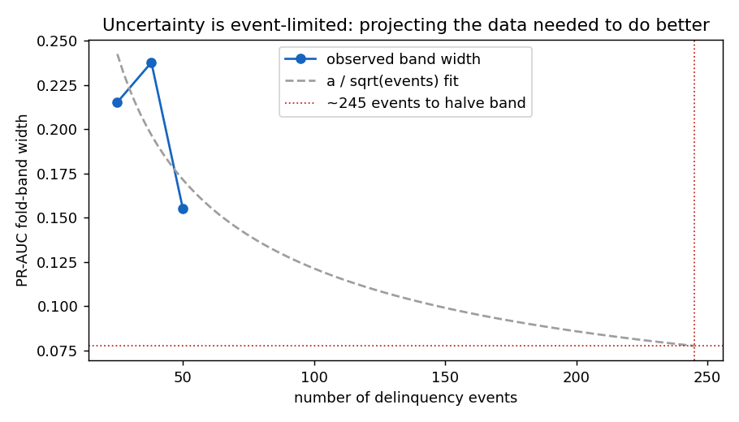

# Can we do better? — sparsity, affordability ratios, and the events ceiling

*Generated by `python -m emerald_ai improve`, seed 20260609, label paidoff_only
(50 events / 3898 rows). Repeated stratified CV (5x5). All fitting inside the fold.
C fixed at 1.0 — no inner-loop tuning on ~10 positives/fold.*

## Experiment 1 — respect the events-per-variable budget
With 50 events and 13 candidate numerics, events-per-variable
is ~3.8 — far below the rule-of-ten (Peduzzi 1996),
so L1 sparsity is the principled lever, not a bigger model.

| index | configuration | n_features_in | median_pr_auc | fold_band | band_width | feats_kept |
| --- | --- | --- | --- | --- | --- | --- |
| 0 | LR L2, base numerics (baseline) | 10 | 0.122 | [0.041, 0.230] | 0.1887 | 10.0 |
| 1 | LR L1-sparse, base numerics | 10 | 0.1214 | [0.040, 0.234] | 0.1947 | 9.9 |
| 2 | LR L1-sparse + affordability ratios | 13 | 0.1211 | [0.040, 0.234] | 0.1938 | 11.3 |
| 3 | LR elastic-net + affordability ratios | 13 | 0.1231 | [0.041, 0.232] | 0.1916 | 11.6 |

- **band_width** = 97.5th − 2.5th fold percentile (smaller = less uncertain).
- **feats_kept** = mean non-zero coefficients (L1 selects; lower = sparser).

**Verdict:** sparsity/ratios **do NOT tighten** the band
(best width 0.189 vs L2 baseline 0.189) and the median PR-AUC
**does not move materially** (best median
0.123). This is the expected null at 50 events: the fold band is dominated by sampling variance, which no model choice on the same data can remove. Reported as a null, not buried.

## Experiment 2 — how many events to actually do better?
Subsampling **both classes by the same fraction** (prevalence — and the PR-AUC floor — held fixed,
so the widths are comparable), averaged over 3 draws per point, the fold-band width falls with the
event count. Fitting the standard `width ∝ 1/√(events)` law:

| index | n_events | median_pr_auc | band_width |
| --- | --- | --- | --- |
| 0 | 25 | 0.1233 | 0.2152 |
| 1 | 38 | 0.1223 | 0.2377 |
| 2 | 50 | 0.1107 | 0.155 |

- Current: **50 events → band width 0.155** (prevalence held fixed across rows).
- Correlation(events, band width) = **-0.69**.
- **Projection: ~245 events (≈4.9x today) would be needed to halve the uncertainty band.** The lever is *data*, not model complexity (Riley 2020).

## So what (Hamming)
The honest answer to "can we predict better": **not by changing the model on these 50 events** —
the band is event-limited, and Experiment 1 returns the expected null. The defensible route to a materially better model is **~245 events** — a longer observation window or a pooled portfolio — quantified above.

## Method → citation audit (Rule 1)
| Method (where) | Status | Paper(s) |
|---|---|---|
| Events-per-variable / sample-size projection (`events_projection`) | **COVERED** | Peduzzi 1996 `W2037668591`, Vittinghoff 2006 `W2130373985`, Riley 2020 `W3012413426` — all **[CURATED]** (D7) |
| L1 / elastic-net penalised logistic regression (`_make_lr`) | **COVERED** | Tibshirani 1996 `W2135046866`, Zou & Hastie 2005 `W2122825543` — **[CURATED]** (D10) |
| Affordability-ratio feature engineering (`affordability_features`) | **COVERED** | Altman 1968 `W2124532504` — **[CURATED]** (D11) |
| Feature selection under class imbalance | **COVERED** | Wasikowski & Chen 2009 `W2138776277` — **[CURATED]** (D12) |

All methods are now citation-backed (D10–D12 curated 2026-06-29); the experiment is no longer
provisional.

---
*Reproduce: `python -m emerald_ai improve`*
