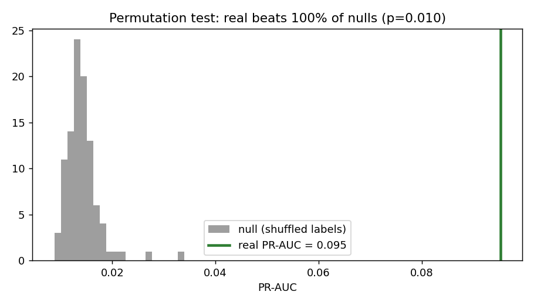
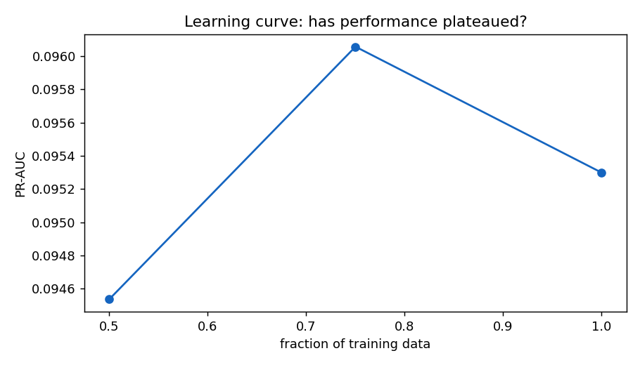
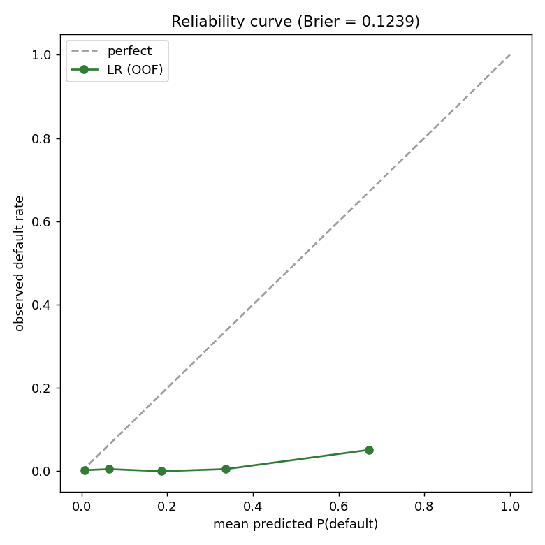

# Rule 2 — Evidence that the model learns (not noise)

*Generated by `python -m emerald_ai evidence`, seed 20260609, label scheme paidoff_only
(prevalence 0.0128, 50 events). All checks reuse the project pipeline.*

## 1. Permutation test (the key check)
Shuffle the labels and rerun the full out-of-fold pipeline 100 times to build a null
distribution; the real model must clearly exceed it.

- **Real PR-AUC = 0.095**; null mean 0.014, null max 0.034.
- Real beats **100%** of permutations; **p = 0.010**.
- **Verdict: real signal — clears the null.**

## 2. Baselines (how much does the full model add?)
| index | model | pr_auc |
| --- | --- | --- |
| 0 | dummy (prevalence floor) | 0.0128 |
| 1 | LR | Credit Score only | 0.0104 |
| 2 | LR | Revenue only | 0.0645 |
| 3 | LR | Time In Business only | 0.0114 |
| 4 | LR | Average Monthly Sales only | 0.0097 |
| 5 | FULL model (logreg+class_weight, 17 feats) | 0.0952 |

## 3. Stability across CV seeds
| index | seed | pr_auc | recall_decile |
| --- | --- | --- | --- |
| 0 | 1 | 0.09 | 0.6 |
| 1 | 7 | 0.093 | 0.64 |
| 2 | 21 | 0.093 | 0.6 |
| 3 | 42 | 0.091 | 0.62 |
| 4 | 99 | 0.087 | 0.56 |

PR-AUC 0.091 ± 0.002; recall@decile 0.604
± 0.027; prevalence floor 0.0128.
**The interval sits well above the floor — stable signal.**

## 4. Learning curve
| index | train_frac | pr_auc |
| --- | --- | --- |
| 0 | 0.5 | 0.0945 |
| 1 | 0.75 | 0.0961 |
| 2 | 1.0 | 0.0953 |

**Performance has plateaued** between 75% and 100%
of the data — consistent with the dataset being too small to reward more complex models, which SUPPORTS the logistic-regression finding (events-per-variable literature, Peduzzi 1996; Riley 2020).

## 5. Calibration evidence
Brier score = **0.1239** vs a prevalence-only Brier of ≈ 0.0127.
**Honest limitation: the model's Brier is far WORSE than the trivial base-rate predictor** — class
weighting inflates the predicted probabilities, so the score *ranks* defaults well (Sections 1–4)
but its absolute probabilities are not trustworthy. This is a known effect of cost-sensitive
training and is exactly the gap **Phase 4 post-hoc calibration (Platt/isotonic)** exists to close.
The reliability curve below shows the overconfidence directly — reported, not hidden.

---
*Reproduce: `python -m emerald_ai evidence`*
