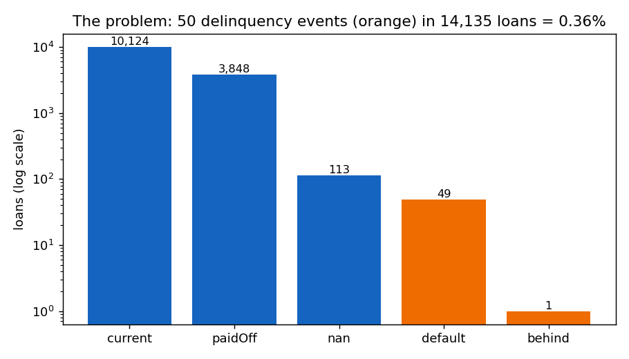
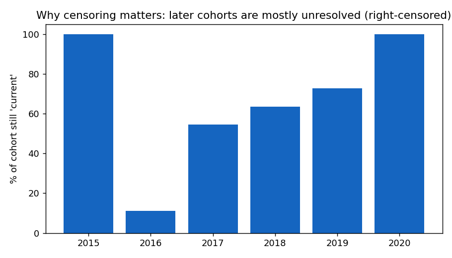
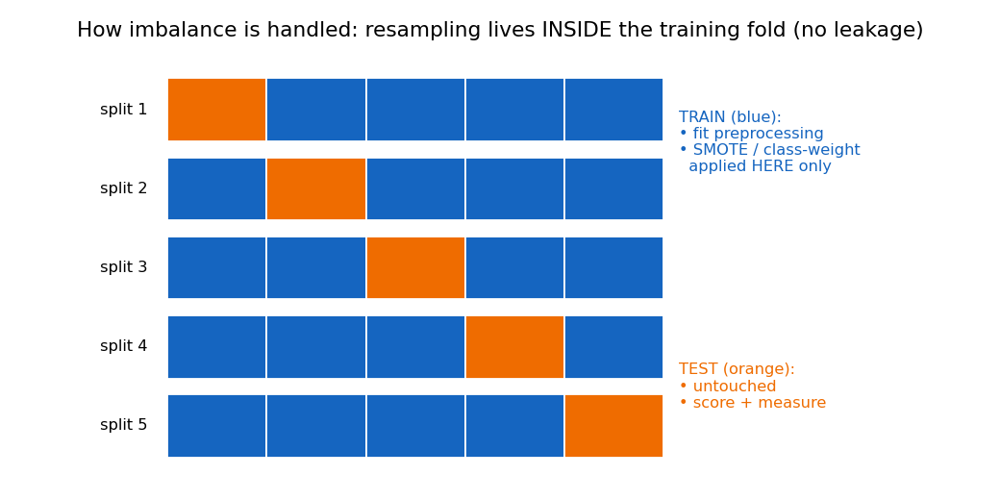
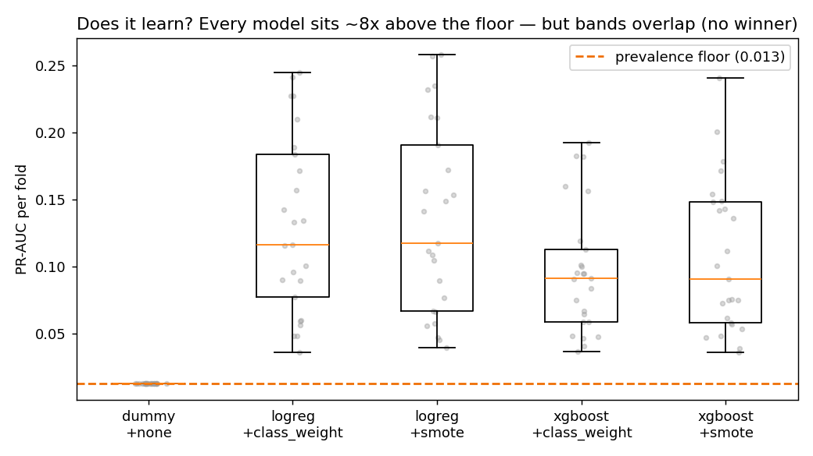
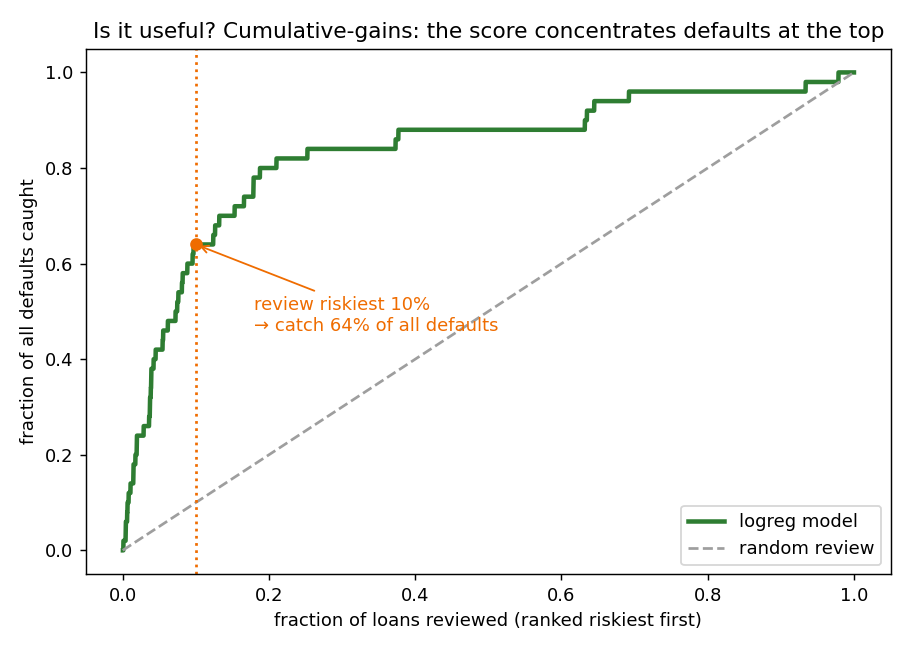
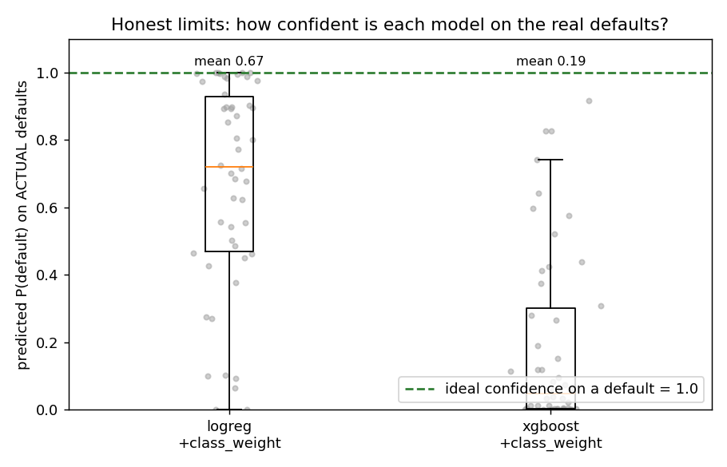

# Visual Story — handling 0.36% imbalance, and proving it works

*Generated by `python -m emerald_ai figures`, seed 20260609. Five steps, each a figure.*

## Step 1 — The problem
Only **50 loans** ever go delinquent out of 14,135 (**0.36%**), and most loans are still
unresolved (right-censored), worse for recent cohorts.

## Step 2 — How we handle it (without cheating)
Resampling (SMOTE) and class-weighting are applied **only inside the training part of each
cross-validation split**. The test block never sees synthetic rows or the encoder's knowledge —
so the scores are honest.

## Step 3 — Does the model actually learn?
Across 25 folds, every real model scores **~8× above the prevalence floor** — it is finding
signal, not guessing. The boxes also **overlap**, which is why we honestly report *no single
winning model* (RQ1).

## Step 4 — Is it USEFUL on this data? (the key proof)
Rank every loan by predicted risk and review the riskiest first. Reviewing just the **top 10%**
captures **64% of all defaults** — far above the 10% a random review would catch.
*That* is the operational value, and it survives the small sample.

## Step 5 — Honest limits: calibration
On the actual defaults, the logistic model is far more confident (closer to the ideal 1.0) than
XGBoost — which is why LR is the better-calibrated choice and why Phase 4 (calibration) targets
exactly this gap.

---
*Reproduce: `python -m emerald_ai figures`*
